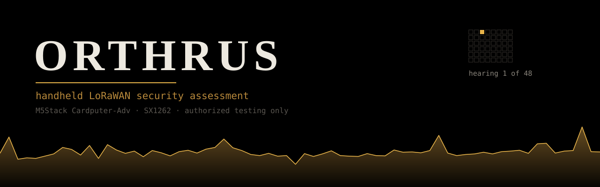
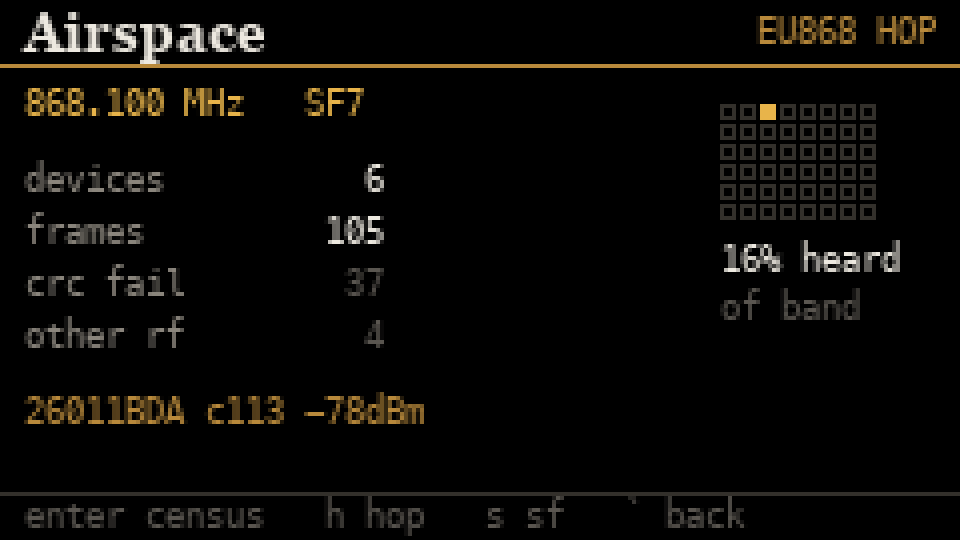
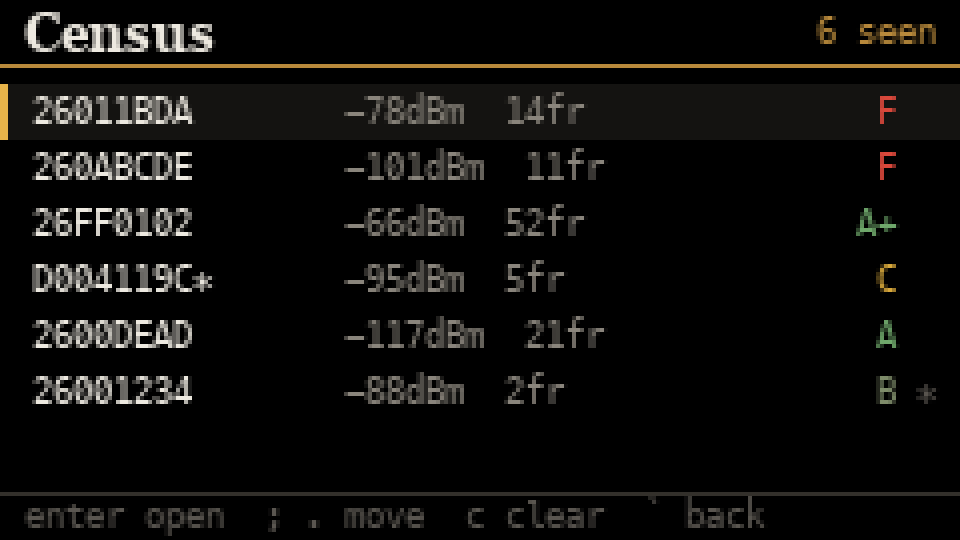
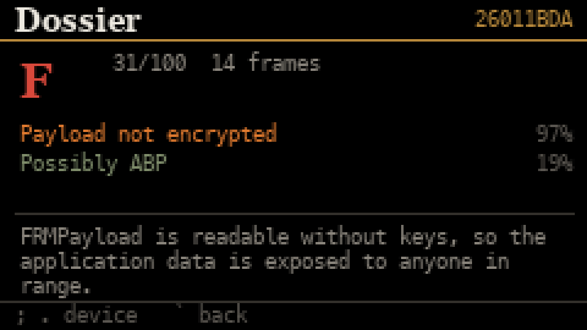

<p align="center">
  
</p>

<p align="center">
  <a href="https://github.com/at0m-b0mb/Orthrus-CardputerAdv/actions/workflows/ci.yml"></a>
  
  
  
  
</p>

> **Every LoRaWAN security tool needs a laptop, an SDR, or a gateway. This one fits in your pocket.**

Orthrus listens to the LoRaWAN devices around you, builds a census of them, and
grades each one — on battery, on a keyboard-sized device, with no host computer
involved.

> The spectrum trace in the banner above is not an illustration. It is the real
> 863–930 MHz sweep this device measured, read out of its own self-test log.

---

<p align="center">
  
  
  
</p>

> Every grade, confidence value and finding in those screenshots came out of the
> real parser, census and grader — see [tools/screendump](tools/screendump). If a
> grade here is wrong, the engine is wrong, and a test says so. CI rebuilds them
> from the engine on every push.

---

## Why this exists

LoRaWAN runs utility meters, building sensors, agricultural telemetry and asset
tracking. It is deployed at enormous scale and audited almost never, because
until now auditing it meant carrying a laptop and a software-defined radio.

Everything that exists today is tethered:

| Tool | Stars | Needs |
| --- | ---: | --- |
| [IOActive/laf](https://github.com/IOActive/laf) | 188 | Python, a gateway or SDR, a server |
| [seemoo-lab/chirpotle](https://github.com/seemoo-lab/chirpotle) | 42 | Laptop controller plus multiple Pi nodes |
| [konicst1/lorattack](https://github.com/konicst1/lorattack) | 28 | SDR |
| [CatWAN USB Stick](https://github.com/ElectronicCats/CatWAN_USB_Stick) | 49 | Tethered to a PC |

Orthrus is none of those. You walk a site with it.

---

## The rule that governs every finding

> ### Presence is proof. Absence is not.

A single SX1262 camps on **one channel at one spreading factor**. EU868 has
eight channels and six spreading factors — 48 combinations — so a parked radio
hears about **2%** of the band. US915 is far worse.

That fact drives the whole design:

- **Findings from what we saw** score at full weight. A frame counter that went
  backwards went backwards. Missing 98% of the band does not make the 2% we
  heard less true.
- **Findings from what we did not see** are capped by coverage, and below a 20%
  coverage floor they are not emitted at all. Instead the device says plainly:
  *"coverage too low to judge."*
- **Grades carry a provisional mark** when the evidence under them is thin. An
  A+ from 16% of the band should not read like an A+ from all of it.
- **Claims we cannot separate from our own tuning are not made.** Parked on
  SF12, every device you can hear *is* at SF12 — so "stuck at a high spreading
  factor" is only ever reported when more than one was actually swept.
- **No confidence value ever reaches 100.** A passive listener without keys
  cannot be certain, and a tool that prints certainty it has not earned is
  lying.

The signature element on screen is the **coverage grid**: all 48 channel/SF
cells drawn, with the one you are camped on lit. Your blind spot is visible
without reading a word. Press `h` and watch it fill in as the radio hops.

---

## What it finds

Passively, without keys:

| Finding | Severity | How it is established |
| --- | --- | --- |
| Frame counter reset | Critical | A counter fell without wrapping — every frame below the old value is replayable |
| Join nonce reused | High | A DevNonce repeated; in LoRaWAN 1.0.x the join can be replayed |
| Payload not encrypted | High | FRMPayload is readable cleartext — no keys needed to prove it |
| MAC commands in two places | Medium | FPort 0 and FOpts populated together, which the spec forbids |
| Frame counter repeated | Medium | Same counter twice: retransmission or replay, and we say we cannot tell which |
| Rejoining repeatedly | Medium | Join churn well beyond a healthy device |
| ADR never set | Low | Stuck at a slow rate, burning airtime and battery |
| Every uplink confirmed | Low | Forces a downlink each time; an amplification surface |
| Stuck at high SF | Low | SF11/SF12 only — reported only if several SFs were swept |

Cleartext detection **refuses to speak below 8 bytes**. Ciphertext is
all-printable by luck roughly once in 2,700 at that length, and calling that
plaintext would be a lie dressed as a finding.

---

## Spectrum

Sweeping the band at ~1 second per pass, with max-hold so bursty transmitters
are visible at all. It began life as the measurement that proved the radio
genuinely retunes; it stayed because "what is transmitting around here?" is a
question worth answering before you know which protocol to point at.

Entering it says **capture paused** on screen, because one radio cannot sweep
and listen at the same time and pretending otherwise would be dishonest.

---

## Credentials

Hold a badge to the reader and Orthrus tells you what it is, what it relies on
for security, and how hard it would be to copy — all from anticollision alone,
which is exactly what someone standing next to you in a lift gets.

A real badge, read on hardware:

```
ATQA 0004  SAK 08  UID 0B701E59  (4-byte)
family Mifare Classic 1K, cipher Crypto1 (broken)
GRADE F (15/100)  [surface read only]
   CRITICAL  Broken cipher (Crypto1)     97%
   MEDIUM    4-byte UID                  90%
   INFO      Reader policy not visible
   INFO      No key probe attempted
```

### The ceiling that shapes this too

**You can read a badge. You cannot see what the reader does with it** — and the
overwhelming majority of access control installations compare the UID and
nothing else. A UID is broadcast unauthenticated by every card ever made. Against
a UID-only reader, the finest DESFire on the market is a number anyone can copy.

So **no card can earn A+ from a read alone**, and the device says why. The grade
describes the credential's potential; the control that actually matters is
invisible from where we are standing.

Grading is by how hard the credential is to copy. Crypto1 has been publicly
broken since 2008, so a Classic cannot be graded sound however tidy it is. A card
with nothing to authenticate against grades worse still, because it needs no
attack at all. And a published key that actually opened a sector is the worst
thing the tool can find, because we did it rather than inferred it.

Two identification subtleties a naive SAK lookup gets wrong: a card setting both
the ISO-DEP and Crypto1 bits is reported as **the weaker half**, because the
Crypto1 sectors are what an attacker will go for; and a 4-byte UID beginning
`0x08` is random-per-session by spec, so it is a privacy feature and is not
scored as a cloneable identifier.

The WS1850S driver is written out rather than pulled from an MFRC522 library:
every byte it parses comes off a card an attacker may have built, so the length
handling is the security-relevant part and it should not be buried in a
dependency. It trusts the measured frame length over anything the card claims.

---

## Evidence integrity

A capture that ends as an editable CSV is an anecdote. Orthrus links every
record with a SHA-256 hash chain:

```
head(n) = SHA256( head(n-1) || record(n) )
```

Change, insert, delete or reorder anything in the middle of the log and every
digest from that point on stops matching. Verification is offline and needs no
key.

**What it does not prove, stated plainly:** anyone who can rewrite the whole
file can recompute the whole chain. A keyless chain cannot stop that. What
closes the gap is recording the head digest somewhere the file cannot reach —
which is why the device shows it on screen at the end of a session. Verified
against a head recorded that way, the log is genuinely tamper-evident. It also
proves nothing about *who* produced the log; that needs a signing key, and a
signing key on a device an attacker may be holding is not a signature anyone
should trust.

Both properties, including the limitation, are covered by tests.

---

## Hardware

| Part | Notes |
| --- | --- |
| [M5Stack Cardputer-Adv](https://shop.m5stack.com/products/m5stack-cardputer-adv-version-esp32-s3) | ESP32-S3, 8 MB flash, **no PSRAM** |
| [Cap LoRa-1262](https://shop.m5stack.com/products/cap-lora-1262-for-cardputer-adv-sx1262-atgm336h) | SX1262 + ATGM336H GPS |

### Pin map, verified on hardware

M5's own documentation for the cap is wrong in two places: it labels NSS as
"SCK", and it puts the GPS on G8/G9, which is the internal I²C bus shared by the
codec, IMU and keyboard controller. Following the docs gets you a radio that
never answers.

| SX1262 | GPIO | | ATGM336H GPS | GPIO |
| --- | --- | --- | --- | --- |
| SCK / MOSI / MISO | 40 / 14 / 39 — **shared with microSD** | | ESP32 RX ← GPS TX | 15 |
| NSS | **5** | | ESP32 TX → GPS RX | 13 |
| RST / BUSY / DIO1 | 3 / 6 / 4 | | UART2 @ 115200 | — |

The radio also needs **TCXO at 1.8 V on DIO3** and **DIO2 driving the RF
switch** — neither is RadioLib's default.

### Two Grove ports, not one

An earlier version of this README claimed the board's Port A was the only
expansion left with the cap fitted. That was wrong. **The LoRa cap carries its
own Grove port**, so both readers can be connected at once — confirmed on
hardware with both units plugged in:

```
portA(G1/G2)  0x50  NFC Universal (ST25R3916)
cap  (G8/G9)  0x28  RFID2 (WS1850S)
```

| Port | Pins | Bus |
| --- | --- | --- |
| Board's Port A | G1 = SCL, G2 = SDA | `M5.Ex_I2C` |
| Cap pass-through | G9 = SCL, G8 = SDA | `M5.In_I2C` — shared with the codec, IMU and keyboard |

The IR unit needs Port A's pins as plain GPIO, so it cannot share *that* port
with an I²C unit — but it can sit on Port A while a reader uses the cap's.

---

## Install

Grab `orthrus-<version>-cardputer-adv.bin` from
[Releases](https://github.com/at0m-b0mb/Orthrus-CardputerAdv/releases) and flash
it. The ESP32-S3's ROM USB-JTAG always answers, so **you never need to hold the
BOOT button**:

```bash
esptool --port /dev/cu.usbmodem2101 write-flash 0x0 orthrus-cardputer-adv.bin
```

Or build it yourself:

```bash
pio run -t upload
```

### Keys

| Key | Does |
| --- | --- |
| `;` `.` | Move |
| `enter` | Open |
| `` ` `` | Back |
| `h` | Toggle channel hopping |
| `s` | Step spreading factor |
| `x` | Spectrum sweep |
| `c` | Clear the capture (in Census) |
| `r` | Badge roll (in Credentials) |
| `m` | Clear max-hold (in Spectrum) |

---

## Testing

Anything that decides whether a finding is true lives in `lib/core`, builds on
the host, and is covered by tests. The firmware is glue around it.

```bash
pio test -e native            # 107 host tests, no board required
pio run -e selftest -t upload # 35 checks on the real device
```

The on-device self-test exists because host tests cannot prove the ESP32 build
agrees, that the radio really retunes, or that the radio and SD card keep
coexisting on one SPI bus. **Its first run crashed the board** — `sizeof(Census)`
is 19,984 bytes and the Arduino `loopTask` stack is 8 KB — which is exactly the
sort of thing it is for.

What it establishes on real hardware:

- the target build parses, grades and scores identically to the host
- the radio really retunes: sweeping 863–930 MHz gives a floor from −116.9 to
  −103.6 dBm with **13.3 dB of frequency-dependent structure**, where a stuck
  synthesiser would read flat
- 150 rounds of interleaved SD writes and radio retunes: **zero errors** on
  either side of the shared bus
- 20,000 frames through census and grader leak **exactly zero bytes**
- a full 116-bin spectrum sweep completes in **1,077 ms**

The parser is additionally fuzzed under AddressSanitizer and UndefinedBehaviour
Sanitizer — 3,000,000 hostile frames, zero findings — and that runs in CI.

---

## Layout

```
lib/core/lorawan/    parser, census, grader, channel plans   <- host-tested
lib/core/credential/ badge identification and grading         <- host-tested
lib/core/crypto/     SHA-256, checked against the NIST vectors
lib/core/evidence/   tamper-evident hash chain
src/hal/             board pins, SX1262 receive path, WS1850S reader
src/app/             design tokens and drawing
src/modules/         Airspace, Spectrum and Credentials
test/native/         107 tests, no hardware needed
tools/               screendump, mockup renderer, brand generator
```

---

## Status

| Surface | State |
| --- | --- |
| **Airspace** — LoRa/LoRaWAN census and grading | Working |
| **Spectrum** — live band sweep with max-hold | Working |
| **Perimeter** — Wi-Fi recon and captive portals | Not built |
| **Credentials** — 13.56 MHz badge identify and grade | Working |
| **Control** — infrared and USB payloads | Not built |
| **Engagement** — scope, evidence log, export | Engine built, not yet wired to the UI |

Unbuilt surfaces say so on screen rather than presenting empty menus.

**Not yet proven:** the receive front end is confirmed alive and confirmed to
retune, but decoding real over-the-air LoRaWAN has not been demonstrated yet —
that needs live traffic to listen to. Said here rather than left for you to
discover.

---

## What this deliberately does not do

**No deauthentication, jamming, or RF/BLE flooding.** Not an oversight — a
decision, for three reasons. It is denial of service rather than assessment. It
is the single feature that gets devices like this pulled from sale and their
sellers into regulatory trouble. And it is unnecessary: a captive-portal evil
twin works on new associations, and detecting deauth is better served by a
purpose-built detector.

---

## Authorized use only

Orthrus is built for security professionals testing systems they have written
permission to test. Passive listening is lawful in most jurisdictions;
transmitting is not always, and LoRaWAN duty-cycle rules vary by region.
Understand your local regulations. You are responsible for what you point it at.

---

## Licence

MIT. See [LICENSE](LICENSE).
